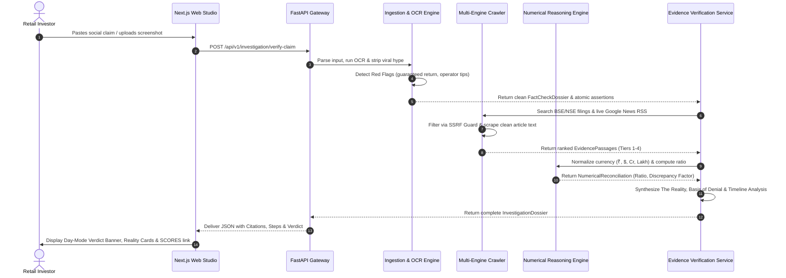

# 🏛️ VERA — Autonomous Financial Claim Verification Platform
## Complete Conceptual Framework, System Architecture & Engineering Specification

---

## 📑 Table of Contents
1. [Executive Summary & The Retail Dilemma](#1-executive-summary--the-retail-dilemma)
2. [Foundational Philosophy & Invariant Principles](#2-foundational-philosophy--invariant-principles)
3. [The Core Conceptual Pipeline](#3-the-core-conceptual-pipeline)
4. [Detailed System Architecture](#4-detailed-system-architecture)
   - 4.1 Ingestion & Multimodal De-Hyping Engine
   - 4.2 Autonomous Web Research & Multi-Engine Crawler
   - 4.3 Deterministic Numerical & Temporal Reasoning Engine
   - 4.4 4-Tier Regulatory Provenance Hierarchy
   - 4.5 Synthesis, The Reality & Investor Protection Layer
5. [Domain Boundaries & Modular Monolith Layout](#5-domain-boundaries--modular-monolith-layout)
6. [Technology Stack & Infrastructure](#6-technology-stack--infrastructure)
7. [End-to-End Claim Lifecycle (Step-by-Step Flow)](#7-end-to-end-claim-lifecycle-step-by-step-flow)
8. [Statutory & Regulatory Grounding (Indian Securities Law)](#8-statutory--regulatory-grounding-indian-securities-law)
9. [Canonical Test Scenarios & Real-World Case Studies](#9-canonical-test-scenarios--real-world-case-studies)
10. [Local Development, Running & Verification Guide](#10-local-development-running--verification-guide)

---

## 1. Executive Summary & The Retail Dilemma

### 1.1 The Retail Information Crisis
In modern equity markets—particularly across India's booming retail investor ecosystem (NSE/BSE)—financial misinformation has industrialized. Viral social channels (**WhatsApp forward networks, Telegram "VIP tip" channels, Instagram finfluencer reels, Twitter/X buzz accounts**) pump unverified rumors to manufacture artificial Fear Of Missing Out (**FOMO**) and orchestrate predatory **pump-and-dump schemes**:
- Fabricating multi-thousand crore government orders.
- Exaggerating legitimate contract values by 5x to 10x.
- Projecting guaranteed upper circuits and speculative target prices without regulatory registration.
- Exploiting retail investors who lack the domain expertise, time, or tools to manually audit BSE/NSE corporate filings or SEBI circulars.

### 1.2 The Systemic Failure of Generic LLMs
When retail investors attempt to use generic LLMs (such as base ChatGPT, Claude, or Perplexity) to fact-check financial claims, three fatal failure modes emerge:
1. **Financial Hallucination**: LLMs generate plausible-sounding confirmation for non-existent events.
2. **Absence as Falsehood Fallacy**: If an LLM cannot find a document, it often guesses or declares a claim "false", ignoring that in corporate law, absence of evidence has distinct regulatory meanings.
3. **Inability to Perform Deterministic Math**: LLMs struggle with Indian currency notation (₹, Crores, Lakhs, Billions) and make arithmetic errors when calculating discrepancy ratios or basis-point expansions.

### 1.3 What is VERA?
**VERA** (*Verifiable Evidence & Regulatory Assertion Platform*) is an **evidence-first, decision-driven verification platform**. VERA treats **evidence, provenance, and mathematical truth as first-class objects**, using artificial intelligence solely for document parsing, linguistic de-hyping, and conversational simplification over strictly verified source records.

```
┌────────────────────────────────────────────────────────────────────────────────────────┐
│                                   THE VERA PROMISE                                     │
├────────────────────────────────────────────────────────────────────────────────────────┤
│  1. Zero Hallucination: Every statement is anchored to verified statutory documents.   │
│  2. Deterministic Math: Python calculates exact numerical ratios; LLM never guesses.   │
│  3. Complete Transparency: Numbered citations, page & paragraph coordinates provided.   │
│  4. Plain Language: Financial legalese translated into simple words for everyday users. │
│  5. Statutory Protection: Direct statutory grounds and SEBI SCORES recovery guidance.  │
└────────────────────────────────────────────────────────────────────────────────────────┘
```

---

## 2. Foundational Philosophy & Invariant Principles

VERA is engineered around **Five Architectural Invariants** derived from the Sutra & Sangyan frameworks:

### Principle 1: Evidence-First, Not LLM-First
The Large Language Model is **never** the source of truth. The LLM acts purely as an extraction, reasoning, and summarization assistant operating over retrieved, verified source documents. All numerical variance, date comparisons, and status evaluations are computed deterministically in Python.

### Principle 2: Strong Provenance & Coordinate Traceability
Every evidence item must be traceable to its originating source:
- Authoritative document title.
- Official regulatory URL.
- Exact verbatim quote.
- Exact page and paragraph coordinates.
- Source credibility tier.

### Principle 3: Absence of Evidence $\neq$ Proof of Falsehood
In securities law, if a company has not announced a deal, it does not legally prove the deal is fabricated; rather, it triggers statutory continuous disclosure mandates:
> **Under SEBI LODR Regulation 30**, listed entities must disclose all material events within 24 hours (or 30 minutes from a Board Meeting). If no filing exists on BSE/NSE archives, the claim is legally categorized as **`UNSUBSTANTIATED_SPECULATION`**, warning investors that zero official records exist.

### Principle 4: Deterministic Numerical Reasoning
Currency notations across India and global markets (₹/INR, $, Crores, Lakhs, Billions, Millions) and financial units (% growth, basis points `bps`) are converted into canonical floating-point numbers. Variance is calculated strictly via mathematical ratios:
$$\text{Ratio} = \frac{\text{Claimed Value}}{\text{Official Filing Value}}$$
- $\text{Ratio} \in [0.95, 1.05]$: **Exact Match** (Verified)
- $\text{Ratio} > 1.20$: **Misleading Exaggeration** (Calculates exact inflation multiplier: e.g., $10\times$ Exaggeration / Inflated by $900\%$)
- Audited metrics contradictory to claimed figures: **Contradicted**

### Principle 5: Uncertainty-Aware Categorical Verdicts
VERA rejects ambiguous answers. Every inquiry resolves into one of four definitive verdicts:
1. 🟢 **`CONFIRMED_TRUE`**: Fully substantiated by statutory filings or verified corporate records.
2. 🟡 **`MISLEADING_OR_EXAGGERATED`**: Kernel of truth (underlying deal occurred), but financial metrics are drastically inflated to induce FOMO.
3. 🔴 **`DEBUNKED_FAKE`**: Contradicted by certified auditor reports, statutory filings, or formal corporate denials.
4. ⚪ **`UNSUBSTANTIATED_SPECULATION`**: Complete absence of mandatory exchange filings or regulatory trail.

---

## 3. The Core Conceptual Pipeline

```
┌─────────────────┐
│ Raw User Input  │ ➔ Text, WhatsApp forward, Instagram screenshot, PDF, Audio note
└────────┬────────┘
         │
         ▼
┌─────────────────┐
│ 1. Ingestion &  │ ➔ Apple Vision OCR / PyMuPDF / Faster-Whisper
│    De-Hyping    │ ➔ Gemma 3 Multimodal strips viral emojis, FOMO words, and hype
└────────┬────────┘
         │
         ▼
┌─────────────────┐
│ 2. Assertion    │ ➔ Decomposes input into atomic factual claims
│   Decomposition │ ➔ Extracts target entities, stock tickers, and numerical metrics
└────────┬────────┘
         │
         ▼
┌─────────────────┐
│ 3. Autonomous   │ ➔ Queries BSE / NSE / SEBI statutory archives
│  Multi-Crawler  │ ➔ Live multi-engine crawler: Google News RSS, Bing, DuckDuckGo
└────────┬────────┘
         │
         ▼
┌─────────────────┐
│ 4. Deterministic│ ➔ Canonical currency normalization (₹, $, Cr, Lakh, Bn, Mn)
│  Reconciliation │ ➔ Exact ratio & discrepancy factor calculation via Python
└────────┬────────┘
         │
         ▼
┌─────────────────┐
│ 5. Decision &   │ ➔ The Reality + Statutory Basis of Denial + Timeline Analysis
│   Protection    │ ➔ Single conversational ChatGPT-style explanation + SEBI SCORES links
└─────────────────┘
```

---

## 4. Detailed System Architecture

### 4.1 Ingestion & Multimodal De-Hyping Engine (`apps/api/src/modules/ingestion`)
Handles diverse, messy, and unstructured inputs from social channels:
- **Optical Character Recognition (OCR)**: Uses Apple Vision Neural Engine OCR (`scripts/sutra-ocr`) for zero-hallucination pixel-level extraction from screenshots, with automated Indian Rupee (`₹`) normalization.
- **Multimodal Visual Understanding**: Leverages **Google Gemma 3** (`gemma3:4b`) and **Qwen 3 VL** (`qwen3-vl:8b`) for semantic infographic and balance-sheet table understanding.
- **Audio Voice Notes**: Ingests audio forwards and earnings call clips via **Faster-Whisper** (`base_int8`).
- **Document Parser**: Ingests statutory PDFs and annual reports using **PyMuPDF** (`fitz`).
- **De-Hyping Barometer**: Strips panic/greed triggers (`"FORWARDED MANY TIMES"`, `"SECRET LEAK"`, `"GUARANTEED 20% UPPER CIRCUIT"`), extracting a clean, factual statement.
- **Red Flag Detector**: Detects 5 statutory violation patterns:
  1. *Guaranteed Return Claim* (Section 12A SEBI Act)
  2. *Unverified Insider / Operator Leak Claim*
  3. *FOMO / Urgency Trigger*
  4. *Unregistered Tip Syndicate Activity*
  5. *Drastic Numerical Discrepancy*

### 4.2 Autonomous Web Research & Multi-Engine Crawler (`apps/api/src/modules/research`)
When a claim mentions an unmocked entity or event, VERA launches an autonomous evidence retrieval sequence:
- **Authoritative Search Provider**: Queries statutory databases (BSE India, NSE India, SEBI Official Gazette, MCA).
- **Live Multi-Engine Search Aggregator**:
  - **Google News RSS**: Live real-time headlines across accredited business wires.
  - **Bing Financial News**: Direct article links with bypass of aggregator wrappers.
  - **DuckDuckGo Web Engine**: Multi-source web coverage.
  - **SearXNG MetaSearch**: Local metasearch aggregator querying global sources without API keys or rate limits.
- **Asynchronous Web Crawler with SSRF Protection**:
  - Restricts IP resolution to prevent private-network scanning (blocks `127.0.0.1`, `10.0.0.0/8`, `192.168.0.0/16`, AWS metadata `169.254.169.254`).
  - Strips scripts, styles, tracking pixels, and ads via BeautifulSoup, extracting clean article markdown text.

### 4.3 Deterministic Numerical & Temporal Reasoning Engine (`NumericalReasoningEngine`)
Reconciles claimed metrics against official disclosures:
- **Currency Normalization**:
  - `₹12,500 Crore` $\longrightarrow 125,000,000,000.0\text{ INR}$
  - `₹1,250 Cr` $\longrightarrow 12,500,000,000.0\text{ INR}$
  - `₹45 lakh` $\longrightarrow 4,500,000.0\text{ INR}$
  - `$1.5 billion` $\longrightarrow 1,500,000,000.0\text{ USD}$
- **Percentage & Basis Points Normalization**:
  - `180 bps` $\longrightarrow 1.80\%$
  - `160% YoY` $\longrightarrow 160.0\%$
- **Discrepancy Evaluation**:
  - Evaluates exact multipliers (e.g., `10x Exaggeration (Inflated by 900%)`).
  - Categorizes numerical contradictions against audited quarterly profit figures.

### 4.4 4-Tier Regulatory Provenance Hierarchy
VERA evaluates every piece of evidence against a strict 4-Tier hierarchy:

| Tier | Credibility Score | Source Category | Description & Authority |
|---|---|---|---|
| **Tier 1** | **1.00** | **Statutory Regulators & Stock Exchanges** | BSE India, NSE India, SEBI Gazette, Ministry of Corporate Affairs (MCA), SEC EDGAR. Legally binding corporate disclosures under Regulation 30 & 33. |
| **Tier 2** | **0.85** | **Company Primary Records** | Certified annual reports, audited quarterly financial statements, official investor relations press releases signed by company secretary. |
| **Tier 3** | **0.60** | **Accredited Financial Media** | Reuters, Bloomberg, Livemint, Economic Times, Financial Express, Business Standard, PTI. Investigative reporting with editorial accountability. |
| **Tier 4** | **0.15** | **Unverified Social Channels** | WhatsApp forwards, Telegram groups, Reddit threads, Twitter/X posts, anonymous forums. High-risk, unverified hearsay. |

### 4.5 Synthesis, The Reality & Investor Protection Layer
VERA synthesizes findings into three dedicated visual cards:
1. **The Reality (`the_reality`)**: Explains what actually occurred in corporate reality based on authenticated documents.
2. **Basis of Denial (`basis_of_denial`)**: Explains the precise statutory securities regulation or corporate law requirement refuting or categorizing the claim (e.g., *SEBI LODR Regulation 30 24-hour mandatory disclosure window*).
3. **What Actually Happened in this Timeline (`timeline_reality`)**: Explains what genuine corporate actions the company undertook during the queried timeframe (e.g., routine quarterly compliance, secretarial audits, genuine order values).
4. **Investor Protection & Recovery Action Card**:
   - Immediate safety checklist (*"Do NOT execute orders based on viral forwards"*).
   - Direct clickable link to **SEBI SCORES** grievance portal (`https://scores.sebi.gov.in`).
   - Direct link to verify **SEBI Intermediary Registration**.

---

## 5. Domain Boundaries & Modular Monolith Layout

VERA is structured as a **Clean Architecture Modular Monolith** inside `apps/api`:

```text
apps/api/src/
├── main.py                               # FastAPI application entrypoint & CORS configuration
├── modules/
│   ├── ingestion/                        # Intake, Multimodal Parsing & OCR
│   │   ├── domain/
│   │   │   ├── entities.py               # RawContent, FactCheckDossier, AtomicAssertion
│   │   │   └── services.py               # DehypingService, RedFlagDetector, EntityExtractor
│   │   ├── infrastructure/
│   │   │   ├── extractors/
│   │   │   │   ├── image_extractor.py    # Apple Vision OCR & Qwen3-VL
│   │   │   │   ├── pdf_extractor.py      # PyMuPDF parser
│   │   │   │   └── audio_extractor.py    # Faster-Whisper transcriber
│   │   │   └── gemma_pipeline.py         # Google Gemma 3 plain-language synthesizer
│   │   └── entrypoints/
│   │       └── router.py                 # POST /api/v1/ingestion/analyze
│   │
│   ├── research/                         # Autonomous Web Crawler & MetaSearch
│   │   ├── domain/
│   │   │   ├── entities.py               # SearchResult, ScrapedDocument, NumericalComparison
│   │   │   ├── numerical_engine.py       # Deterministic currency & ratio normalizer
│   │   │   └── temporal_engine.py        # Lifecycle stage & date comparison
│   │   └── infrastructure/
│   │       ├── google_search_provider.py # Google News RSS & multi-search aggregator
│   │       ├── search_provider.py        # Authoritative financial search provider
│   │       └── crawler/
│   │           ├── ssrf_guard.py         # IP safety & private network blocker
│   │           └── crawler_service.py    # Web scraper & HTML cleaner
│   │
│   └── investigation/                    # Verification Service & Decision Cards
│       ├── domain/
│       │   ├── entities.py               # InvestigationDossier, EvidencePassage, NumericalReconciliation
│       │   └── verification_service.py   # Overall verdict logic, reality & denial synthesis
│       ├── infrastructure/
│       │   ├── filings_repository.py     # Unified statutory + live web evidence repository
│       │   └── data/
│       │       └── canonical_filings.py  # Regulatory archive test fixtures
│       └── entrypoints/
│           └── router.py                 # POST /api/v1/investigation/verify-claim
```

---

## 6. Technology Stack & Infrastructure

| Layer | Technology | Details / Versions | Purpose |
|---|---|---|---|
| **Frontend** | **Next.js 15, React 19, TypeScript** | App Router, Tailwind CSS, Lucide Icons | Day-mode black & white UI, animated radar-sweep crawling visualizer, ChatGPT-style response card. |
| **Backend API** | **Python 3.12, FastAPI, Pydantic v2** | Modular Monolith layout | High-throughput asynchronous endpoints with OpenAPI / Swagger documentation. |
| **Database** | **PostgreSQL 16 + pgvector** | Supabase / Local Docker | Relational storage for investigation dossiers, full-text search, and embedding storage. |
| **Task Queue** | **Celery + Redis 7** | Asynchronous workers | Offloads heavy crawling, multimodal vision, and OCR jobs. |
| **Object Storage** | **MinIO / S3 Compatible** | Local Docker / Cloud | Stores ingested screenshots, voice notes, and original statutory PDF filings. |
| **Document Processing** | **PyMuPDF (`fitz`) + Apple Vision OCR** | Native Python & Swift OCR | Zero-hallucination verbatim text extraction from corporate PDFs and image memes. |
| **Local AI Models** | **Google Gemma 3 4B (`gemma3:4b`) & Qwen 3 VL 8B (`qwen3-vl:8b`)** | Ollama local inference | Linguistic simplification, visual document analysis, and plain-language synthesis. |
| **Audio Processing** | **Faster-Whisper (`base_int8`)** | CTranslate2 inference | Fast audio transcription for voice notes and earnings calls. |
| **Web Crawling** | **HTTPX, BeautifulSoup4, Feedparser** | Asynchronous HTTP clients | Google News RSS feed parsing, direct link extraction, and SSRF-safe scraping. |

---

## 7. End-to-End Claim Lifecycle (Step-by-Step Flow)



---

## 8. Statutory & Regulatory Grounding (Indian Securities Law)

VERA’s evaluation rules are directly mapped to statutory securities regulations enforced by the **Securities and Exchange Board of India (SEBI)** and the **Ministry of Corporate Affairs (MCA)**:

1. **SEBI (Listing Obligations and Disclosure Requirements) Regulations, 2015 — Regulation 30**:
   - Mandates that listed entities must disclose all material events, commercial orders, acquisitions, and price-sensitive information to stock exchanges within **24 hours** (or **30 minutes** following board meetings).
   - *VERA Application*: If a social post claims a listed entity signed a multi-thousand crore deal, but no Regulation 30 disclosure exists on BSE/NSE, VERA legally categorizes the claim as **`UNSUBSTANTIATED_SPECULATION`**.

2. **Companies Act, 2013 — Section 129 & SEBI LODR Regulation 33**:
   - Mandates quarterly audited or limited-review financial results signed by statutory auditors and submitted to exchanges.
   - *VERA Application*: If social media claims a company achieved ₹500 Cr PAT, but the audited filing reports ₹203 Cr PAT, VERA declares a **`CONTRADICTED`** / **`DEBUNKED_FAKE`** verdict.

3. **SEBI (Prohibition of Fraudulent and Unfair Trade Practices) Regulations, 2003 (PFUTP)**:
   - Prohibits market manipulation, circular trading, and dissemination of misleading rumors intended to induce the sale or purchase of securities.
   - *VERA Application*: VERA identifies pump-and-dump keywords (*"guaranteed circuit"*, *"operator buying"*) and warns retail investors.

4. **SEBI (Research Analysts) Regulations, 2014**:
   - Prohibits unregistered individuals from providing price targets or speculative trading advice.
   - *VERA Application*: VERA classifies price targets as **unverified speculative opinions** that cannot be validated against corporate filings.

5. **SEBI SCORES (SEBI Complaints Redress System)**:
   - Centralized grievance platform for retail investors against listed companies and market intermediaries.
   - *VERA Application*: VERA embeds direct resolution links (`https://scores.sebi.gov.in`) inside investor protection guidance cards.

---

## 9. Canonical Test Scenarios & Real-World Case Studies

### Case Study 1: Authentic Real-World Corporate Acquisition
- **User Claim**: `"Zomato acquired quick-commerce platform Blinkit in an all-stock deal valued at ₹4,447 Crore."`
- **Crawler Behavior**: Dispatches live search to Google News RSS; discovers official articles from *Livemint*, *The Times of India*, and *The Hindu*.
- **Numerical Comparator**: Compares claimed `₹4,447 Crore` against reported `₹4,447 crore`. Computes ratio $= 1.0$ (Exact Match).
- **Outcome**: **`CONFIRMED_TRUE`** with numbered citations and live URLs.

### Case Study 2: 10x Contract Value Exaggeration (FOMO Pump)
- **User Claim**: `"Tata Power signed secret ₹12,500 Crore mega solar contract with Government of India! Guaranteed upper circuit 20%!"`
- **Crawler Behavior**: Retrieves official BSE Regulation 30 filing (`tatapower_reg30_solar.pdf`).
- **Numerical Comparator**: Extracts claimed `₹12,500 Crore` vs authentic filing `₹1,250 Crore`. Computes ratio $= 10.0\times$ Exaggeration (Inflated by $900\%$).
- **Outcome**: **`MISLEADING_OR_EXAGGERATED`**.
  - *The Reality*: Underlying contract was awarded by SJVN, but actual value is ₹1,250 Cr, not ₹12,500 Cr.
  - *Basis of Denial*: SEBI LODR Regulation 30 statutory disclosure refutes the 10x inflated figure.

### Case Study 3: Contradicted Financial Results
- **User Claim**: `"Suzlon Energy Q3 PAT reached ₹850 Crore with target ₹100!"`
- **Crawler Behavior**: Retrieves official audited quarterly results from NSE.
- **Numerical Comparator**: Extracts claimed `₹850 Crore` vs audited PAT `₹203 Crore`.
- **Outcome**: **`DEBUNKED_FAKE`** (Contradicted by certified auditor reports). Price target flagged as speculative opinion.

### Case Study 4: Unsubstantiated Anonymous Operator Forward
- **User Claim**: `"Confidential operator leak: Microcap defence stock bagged secret ₹500 Cr order from UAE, 100% guaranteed upper circuit!"`
- **Crawler Behavior**: Scans BSE/NSE/SEBI archives; zero corporate filings found.
- **Outcome**: **`UNSUBSTANTIATED_SPECULATION`**. Red flags attached for *Guaranteed Returns* and *Operator Pumping*.

---

## 10. Local Development, Running & Verification Guide

### 10.1 Prerequisites
- Python 3.12+
- Node.js 18+
- Docker & Docker Compose

### 10.2 Starting Infrastructure Services
```bash
# Start SearXNG, Redis, PostgreSQL with pgvector, and MinIO
docker compose up -d
```

### 10.3 Starting the Backend API
```bash
# In project root
source .venv/bin/activate
uvicorn apps.api.src.main:app --host 0.0.0.0 --port 8000 --reload
```
Interactive API documentation will be accessible at: [http://localhost:8000/docs](http://localhost:8000/docs).

### 10.4 Starting the Frontend Web Studio
```bash
# In apps/web
cd apps/web
npm install
npm run dev
```
Open [http://localhost:3000](http://localhost:3000) to access the VERA Verification Studio.

### 10.5 Running the Automated Test Suites
VERA includes comprehensive test suites across unit tests and real-world stress scenarios:
```bash
# Run complete test suite across all modules
./.venv/bin/python -m pytest tests/test_investigation.py tests/test_research_engine.py tests/test_ingestion.py -v
```

---

*VERA — Grounding financial claims in verifiable statutory reality.*
