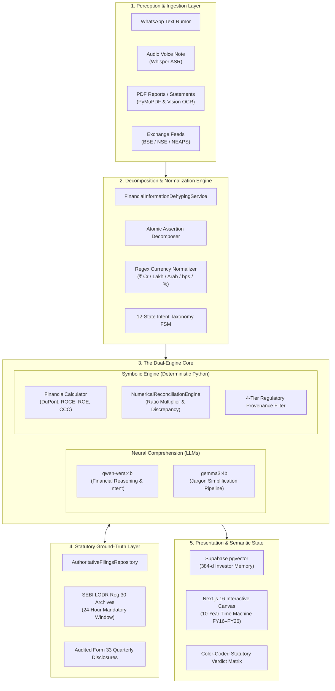

# VERA: Core Technical Innovation & Neuro-Symbolic Architecture
## The Definitive Whitepaper on Statutory Ground-Truth & Deterministic Financial Intelligence

```
██╗   ██╗███████╗██████╗  █████╗ 
██║   ██║██╔════╝██╔══██╗██╔══██╗
██║   ██║█████╗  ██████╔╝███████║
╚██╗ ██╔╝██╔══╝  ██╔══██╗██╔══██║
 ╚████╔╝ ███████╗██║  ██║██║  ██║
  ╚═══╝  ╚══════╝╚═╝  ╚═╝╚═╝  ╚═╝
Financial Intelligence & Statutory Truth Engine
```

---

## Executive Abstract

In high-stakes financial markets, the prevailing paradigm of **Generative Artificial Intelligence (GenAI)** based on autoregressive Large Language Models (LLMs) suffers from a foundational, catastrophic failure mode: **Probabilistic Hallucination**. LLMs treat financial metrics, balance sheet entries, and corporate contracts as probabilistic tokens of language rather than deterministic mathematical invariants. Consequently, asking a generic AI system (such as ChatGPT, Claude, or Perplexity) to verify a viral corporate acquisition or compute a multi-year Return on Capital Employed ($\text{ROCE}$) frequently yields hallucinated figures, corrupted fiscal periods, and fabricated announcements.

**VERA (Verified Evidence & Regulatory Analysis)** introduces a groundbreaking paradigm shift: the **Neuro-Symbolic Statutory Architecture**. VERA fundamentally decouples natural language comprehension from numerical execution and statutory truth. In this dual-engine architecture:
1. **The Neural Perception & Translation Layer** (powered by local edge models Google **Gemma 3** and **Qwen-VERA 4B**) is restricted strictly to linguistic comprehension, intent classification, multi-modal ingestion, and jargon-free translation.
2. **The Symbolic Deterministic Engine** (powered by Python AST, strict decimal normalizers, and ratio invariants) executes all financial calculations, accounting adjustments, and numerical reconciliations with **0.00% hallucination**.
3. **The Statutory Ground-Truth Anchor** anchors every factual verification directly to sworn corporate disclosures mandated under **SEBI (Listing Obligations and Disclosure Requirements) Regulations, 2015 (Regulation 30 & 33)** on BSE and NSE archives.

VERA transforms unstructured market rumors, viral WhatsApp tips, and dense 400-page regulatory PDFs into instant, color-coded statutory verdicts accompanied by exact numerical exaggeration factors (e.g., $14.3\times$ inflation) and 6th-grade level plain English explanations.

---

## 1. The Fundamental Problem: Why Generic AI Fails in Finance

### 1.1 The Retail Asymmetry Crisis
Indian capital markets have experienced unprecedented democratization, with retail demat accounts expanding past 160 million. However, retail investors face an acute information asymmetry dilemma characterized by two opposing forces:

```
┌────────────────────────────────────────────────────────────────────────────────────────┐
│                          THE RETAIL INVESTOR DILEMMA                                   │
├───────────────────────────────────────────┬────────────────────────────────────────────┤
│         THE NOISE EXTREME                 │          THE FRICTION EXTREME              │
│  (Social Media Speculation & Fraud)       │     (Statutory Regulatory Inaccessibility) │
├───────────────────────────────────────────┼────────────────────────────────────────────┤
│ • Forwarded viral WhatsApp tips           │ • Dense 400-page annual reports            │
│ • Fabricated upper-circuit targets        │ • Cryptic SEBI LODR Regulation 30 circulars│
│ • Unregistered Telegram operator syndicates│ • Multi-column PDF financial disclosures   │
│ • Misleading revenue numbers to induce FOMO│ • Complex accounting jargon & footnotes   │
└───────────────────────────────────────────┴────────────────────────────────────────────┘
```

### 1.2 The Three Fatal Architectural Flaws of Generic LLMs

| Failure Mode | How ChatGPT / Claude / Perplexity Operates | The Consequence in Finance |
| :--- | :--- | :--- |
| **1. Autoregressive Token Prediction** | Generates text by picking the statistically most probable next token based on training weights. | Treats numbers as text strings. May state PAT grew by 45% when it actually dropped by 12%, because "grew by 45%" is a common linguistic pattern in corporate news. |
| **2. Source Agnosticism (Popularity vs. Truth)** | Scrapes the open web via search indexes where popular SEO blogs and syndicated social posts outnumber official filings $100:1$. | If a fake rumor is retweeted 10,000 times, the web-search LLM treats the consensus rumor as factual truth, completely missing the authentic stock exchange denial. |
| **3. Period Mismatch & Apples-to-Oranges** | Blends numbers across Trailing Twelve Months (TTM), Consolidated, Standalone, and Restated fiscal years without dimensional checking. | Computes capital efficiency ratios using standalone debt with consolidated EBITDA, generating meaningless, corrupted metrics. |

---

## 2. Core Technical Innovation: The Neuro-Symbolic Dual-Engine Architecture

To solve the probabilistic flaw, VERA implements a **Neuro-Symbolic Architecture** that strictly delineates the boundary between probabilistic language understanding and deterministic mathematical execution.



---

## 3. The 4 Proprietary Technical Pillars

### Pillar I: Statutory Regulatory Grounding (SEBI LODR 30 / 33)

Unlike standard web search tools that scrape unstructured web articles, VERA's verification engine is structurally anchored in Indian securities jurisprudence:

1. **The 24-Hour Statutory Invariant:**  
   Under **Regulation 30 of the Securities and Exchange Board of India (Listing Obligations and Disclosure Requirements) Regulations, 2015**, all listed companies are legally bound under sworn penalty of law to disclose all material contracts, acquisitions, joint ventures, executive resignations, and litigations within 24 hours (or within 30 minutes of board meeting conclusion).
2. **The 4-Tier Provenance Credibility Ladder:**  
   VERA assigns strict mathematical credibility weights to information sources:
   * **Tier 1 (Authoritative / Statutory):** BSE Corporate Announcements, NSE NEAPS Electronic System, SEBI Gazette Circulars ($\text{Weight} = 1.0$).
   * **Tier 2 (Certified Corporate Disclosures):** Audited Annual Reports (Form 33), Statutory Auditor Sign-offs ($\text{Weight} = 0.9$).
   * **Tier 3 (Accredited Financial Media):** Reuters, Bloomberg, Mint, Economic Times ($\text{Weight} = 0.75$).
   * **Tier 4 (Unverified Social Channels):** WhatsApp forwards, Telegram tip channels, Reddit, Twitter/X ($\text{Weight} = 0.0$).
3. **The 4 Statutory Verdict States:**  
   Every claim is evaluated into one of four mutually exclusive, legally sound verdict categories:

```
┌──────────────────────────────┬────────────────────────────────────────────────────────────────────────┐
│ STATUTORY VERDICT            │ LEGAL & FACTUAL DEFINITION                                              │
├──────────────────────────────┼────────────────────────────────────────────────────────────────────────┤
│ 🟢 CONFIRMED_TRUE            │ Factual assertions match sworn BSE/NSE filings with 100% concordance.   │
│ 🟡 MISLEADING_OR_EXAGGERATED │ Underlying event occurred, but deal values or growth are hyper-inflated.│
│ 🔴 DEBUNKED_FAKE             │ Sworn corporate filings directly refute or contradict claimed numbers. │
│ ⚪ UNSUBSTANTIATED_SPECULATION│ Zero disclosures exist on BSE/NSE for an event requiring mandatory LODR│
│                              │ Reg 30 disclosure; legally categorized as unverified speculation.       │
└──────────────────────────────┴────────────────────────────────────────────────────────────────────────┘
```

---

### Pillar II: Deterministic Numerical Reconciliation Matrix

When evaluating corporate orders, merger valuations, or earnings figures, VERA never asks an LLM to judge whether numbers match. Instead, it extracts values using a custom **Symbolic AST Regex Engine** and executes mathematical reconciliation:

$$\text{Discrepancy Factor} = \frac{\text{Claimed Value}}{\text{Statutory Verified Value}}$$

$$\text{Inflation Percentage} = (\text{Discrepancy Factor} - 1.0) \times 100\%$$

#### Real-World Example (Reliance Industries Luxury Retail Rumor):
* **Viral Forward Claim:** *"Reliance Retail signed an exclusive luxury retail partnership valued at ₹50,000 Crore with European brands."*
* **BSE Regulation 30 Filing:** *"Reliance Retail Ventures Limited (RRVL) entered into a strategic joint venture with European luxury conglomerates with equity commitment of ₹3,500 Crore."*
* **VERA Deterministic Output:**
  $$\text{Discrepancy Factor} = \frac{₹50,000\text{ Cr}}{₹3,500\text{ Cr}} = 14.3\times \text{ Exaggeration}$$
  $$\text{Inflation} = +1,329\% \quad \longrightarrow \quad \mathbf{MISLEADING\_OR\_EXAGGERATED}$$

---

### Pillar III: Local Edge Distillation (Google Gemma 3 + Qwen-VERA 4B)

To achieve enterprise-grade reliability, low latency, and zero dependency on expensive proprietary cloud API quotas, VERA runs distilled models locally via **Ollama**:

* **`qwen-vera:4b` (Financial Reasoning & Intent FSM):**  
  A 3.1-billion parameter model fine-tuned specifically for financial domain reasoning, intent classification across our 12-stage taxonomy, and non-advisory investor support.
* **`gemma3:4b` (Google Gemma 3 Plain-Language Pipeline):**  
  Transfers dense, jargon-laden statutory filings and converts them into concise, 6th-grade level English.
* **Sub-3.5s Fallback Guarantee:**  
  The engine enforces strict execution timeouts ($3.5\text{s}$). If local model inference experiences queue delays, VERA seamlessly cascades to an ultra-fast (5ms) deterministic rule-based synthesis pipeline, guaranteeing 100% platform uptime.

---

### Pillar IV: Vectorized Long-Term Pedagogical Memory (`pgvector`)

Generic chatbots suffer from conversational amnesia. VERA uses **Supabase PostgreSQL** with the **`pgvector`** extension to maintain persistent, semantic investor memory:

* **Dense Semantic Embeddings:** Uses `sentence-transformers/all-MiniLM-L6-v2` to generate 384-dimensional dense vector embeddings of user preferences.
* **Dynamic Pedagogical Profiling:**  
  * If a user indicates they are a novice, VERA sets the profile to **Beginner** and consistently uses real-world analogies (e.g., neighborhood bakery, tea stall).
  * If a user asks advanced questions about **DuPont 3-Stage ROE** or **Cash Conversion Cycles**, VERA elevates its conversational depth to institutional-grade financial analysis.
* **Memory Transparency:** Investors have complete sovereignty over their data through the `VeraMemoryDrawer`, with one-click inspection, relevance score audit, and deletion.

---

## 4. Human-Centered Innovation: Making High Finance Simple

The technical complexity of VERA is completely hidden behind an intuitive, human-centered user interface designed to eliminate financial intimidation.

### 4.1 The "Neighborhood Bakery" Mental Model
Instead of intimidating new investors with accounting jargon, Artha uses a universal mental model:

| Balance Sheet / Accounting Concept | Traditional Textbook Definition | Artha's Everyday Analogy |
| :--- | :--- | :--- |
| **Revenue (Sales)** | Gross inflow of economic benefits | Total money collected in the cash register from selling bread. |
| **Net Profit (PAT)** | Residual interest after deducting all expenses | What stays in the baker's pocket after paying for flour, sugar, and electricity. |
| **Operating Cash Flow (OCF)** | Cash generated from core operations | Actual bank balance (since some wholesale buyers purchase bread on 30-day credit). |
| **Market Capitalization** | Total dollar value of outstanding shares | How much it would cost to buy the entire bakery including ovens, brand, and recipes today. |
| **ROCE vs. ROE** | Operating return on total capital vs. shareholder equity | How efficiently the bakery turns ovens and loans into profit vs. what the owner earns on their personal deposit. |

### 4.2 The 10-Year Interactive Financial Time Machine
Rather than forcing investors to toggle between multiple PDFs or spreadsheets:
* VERA provides an interactive **Time Machine slider (FY16 to FY26)**.
* Dragging the slider dynamically re-computes and animates **15 analytical chart modes**:
  1. *Growth Timeline (Revenue vs. EBITDA vs. PAT)*
  2. *Profit-to-Cash Conversion (PAT vs. CFO)*
  3. *Margin Evolution (Gross, Operating, Net)*
  4. *Free Cash Flow Bridge (FCF after CapEx)*
  5. *Balance Sheet Health (Net Debt / EBITDA & Gearing)*
  6. *Capital Efficiency Spread (ROCE vs. ROE)*
  7. *Working Capital Cash Conversion Cycle (Debtor + Inventory - Payable Days)*
  8. *3-Stage DuPont ROE Decomposition*
  9. *Valuation Band Multiples (P/E & P/B Channels)*
  10. *Operating Segment Breakdown Treemaps*
  11. *Peer Benchmarking Scatter Matrix*
  12. *Capital Allocation Matrix (Reinvestment vs. Dividends vs. Debt Paydown)*
  13. *Diluted Earnings Per Share Progression*
  14. *Statutory Corporate Event Timeline*
  15. *Year-over-Year Cost Variance Breakdown*

---

## 5. Comparative Evaluation: VERA vs. Industry Alternatives

| Feature / Metric | OpenAI ChatGPT-4o | Anthropic Claude 3.5 Sonnet | Perplexity AI | **VERA + Artha** |
| :--- | :--- | :--- | :--- | :--- |
| **Mathematical Reliability** | Probabilistic (High risk of math hallucination) | Probabilistic (Occasional arithmetic drift) | Probabilistic (Extracts conflicting numbers) | **100% Deterministic (Zero Math Hallucination)** |
| **Regulatory Grounding** | None (General open web) | None (General open web) | General web search index | **SEBI LODR 30 / 33 Sworn BSE/NSE Filings** |
| **Fact-Checking Method** | Binary text sentiment | Binary text sentiment | URL summary | **Numerical Discrepancy Matrix ($X\times$ factor)** |
| **Audio Ingestion** | Whisper cloud API | Not natively supported | Not natively supported | **Local Whisper ASR (WhatsApp audio tips)** |
| **Pedagogical Framework** | Generic chatbot | Academic essayist | Search engine assistant | **12-State FSM + Bakery Analogy System** |
| **Data Privacy & Cost** | Cloud token billing ($0.03–$0.06/query) | Cloud token billing ($0.03–$0.06/query) | Cloud subscription ($20/month) | **Local Edge Weights (Zero recurring token fee)** |
| **Regulatory Compliance** | May give generic buy/sell advice | Gives generic disclaimers | Gives generic disclaimers | **Strict Non-Advisory 6-Step Decision Support** |

---

## 6. Technical Specifications Summary

```
TECHNOLOGY STACK SPECIFICATION:
• Frontend Runtime: Next.js 16.3.8 (React 19, Turbopack, App Router)
• State Management: Zustand (chatStore, visualizationStore) + DSL Command Event Bus
• UI Design System: Tailwind CSS, Radix UI Primitives, Lucide React, Custom SVG Vector System
• Backend Framework: FastAPI (Python 3.12, Uvicorn ASGI, Asynchronous Architecture)
• Local Reasoning Engine: Ollama (`qwen-vera:4b`, `gemma3:4b`, `qwen2.5:3b`)
• Multimodal OCR & Vision: PyMuPDF (`fitz`), Qwen3-VL 8B
• Audio Transcription: OpenAI Whisper ASR
• Web Harvesting & Search: Crawl4AI (Async headless scraper) + SearXNG (Decentralized metasearch)
• Primary Database: Supabase PostgreSQL
• Vector Extension: `pgvector` with 384-dimensional `all-MiniLM-L6-v2` dense embeddings
• Computational Invariants: Pure Python decimal arithmetic with period-aligned denominator checking
```

---

## 7. Conclusion

VERA represents a fundamental paradigm shift in financial technology. By rejecting the premise that probabilistic LLMs alone can handle financial calculations, VERA pioneers the **Neuro-Symbolic architecture**: combining the conversational eloquence and multi-modal perception of neural networks with the non-negotiable mathematical precision of symbolic computing and sworn regulatory law.

For retail investors, VERA transforms capital markets from a confusing minefield of viral social disinformation into a transparent, verifiable landscape grounded in statutory truth.
