# VERA (Verified Evidence & Regulatory Analysis)
## Complete Functional Specification & Architecture Manual

```
  ██    ██ ███████ ██████   █████  
  ██    ██ ██      ██   ██ ██   ██ 
  ██    ██ █████   ██████  ███████ 
   ██  ██  ██      ██   ██ ██   ██ 
    ████   ███████ ██   ██ ██   ██ 
  Financial Intelligence & Statutory Evidence Platform
```

---

## 1. Executive Summary & Core Mission

### The Problem in Indian Equities
The Indian retail equity landscape has experienced explosive growth (over 160 million demat accounts), but retail investors are structurally disadvantaged by two opposing extremes:
1. **The Noise Extreme (Social Speculation & Fraud):** Viral Telegram tips, WhatsApp forwarded "internal circulars," Finfluencer hype, and manipulated rumors designed to cause pump-and-dump runs or panic selling.
2. **The Friction Extreme (Statutory Inaccessibility):** Authentic corporate truth is buried inside 400-page annual reports, dense SEBI LODR (Listing Obligations and Disclosure Requirements) filings, and cryptic BSE/NSE PDF circulars that average investors cannot quickly parse.

### The VERA Solution
**VERA** is an evidence-first financial intelligence and statutory verification platform. It operates on a foundational invariant: **Financial facts must be strictly derived from authentic stock exchange filings and deterministic mathematics, never from LLM hallucinations or unverified social claims.**

VERA bridges this gap through a unified, elegant system divided into two synergistic pillars:
* **The Platform (VERA):** A Screener-grade equity intelligence terminal, multi-modal statutory ingestion studio, interactive financial visualizer, and SEBI LODR Regulation 30 rumor verification auditor.
* **The Intelligent Copilot (Artha):** A conversational financial companion and tutor that demystifies balance sheets, guides investors from foundational analogies to advanced DuPont ROE decompositions, and maintains personalized long-term memory via Supabase `pgvector`.

---

## 2. High-Level System Architecture

```mermaid
graph TD
    subgraph ClientLayer ["Frontend Client (apps/web - Next.js 16 + Turbopack)"]
        UI_Nav["VeraNavbar (Brand, Search, Screens, Visualizer, Tools)"]
        UI_Company["CompanyView (Screener Ratios, 10-Yr P&L, Balance Sheet, Peers)"]
        UI_Watch["WatchlistView (Tracked Equities, Metric Cards, Quick Audit)"]
        UI_Viz["VeraConversationalVisualizer (10-Yr Time Machine, Multi-Chart Canvas)"]
        UI_Ingest["IngestionStudio (Multi-Modal OCR, Audio Transcribe, PDF Extractor)"]
        UI_Drawer["VeraAssistantDrawer (Unified Slide-In Copilot)"]
        UI_Artha["Artha Chat Interface (Pedagogical Copilot + Bento Grid)"]
        UI_Evidence["Statutory Evidence Tracker (LODR Reg 30 Verification)"]
    end

    subgraph StateLayer ["Client State & Reactive Stores (Zustand)"]
        Store_Chat["chatStore (Messages, Commands, Supabase Sync)"]
        Store_Viz["visualizationStore (Active Chart, Time Range, DSL Actions)"]
    end

    subgraph APILayer ["Backend API Gateway (apps/api - FastAPI)"]
        API_Chat["/api/v1/chat (Artha Dialogue & Intent Taxonomy)"]
        API_Invest["/api/v1/investigation (Fact-Checking & Audit Engine)"]
        API_Research["/api/v1/research (Deterministic Calculations & Peers)"]
        API_Ingest["/api/v1/ingestion (Multi-Modal Extraction)"]
        API_Mem["/api/v1/memory (Supabase pgvector Memory & Profiling)"]
        API_Auth["/api/v1/auth (Session & User Identity)"]
    end

    subgraph EngineLayer ["Core Domain & Reasoning Engines"]
        Calc_Engine["FinancialCalculator (Deterministic Non-Hallucinating Math)"]
        Taxonomy["IntentTaxonomy (12-Stage Pedagogical Classification)"]
        Qwen_Pipe["QwenReasoningPipeline (Fine-Tuned 3.4B Model)"]
        Gemma_Pipe["GemmaSimplificationPipeline (Plain-English Explanations)"]
        Filings_Repo["AuthoritativeFilingsRepository (BSE/NSE LODR Archives)"]
        Data_Gatherer["ArthaDataGatherer (Autonomous Live Market Crawler)"]
    end

    subgraph StorageLayer ["Persistence & External Cloud"]
        DB_Supa["Supabase PostgreSQL + pgvector (Semantic Investor Memories)"]
        Vector_Embed["MiniLM 384-d Embedding Engine"]
        Exchange_Filings["BSE / NSE Statutory Disclosures & Annual Reports"]
    end

    ClientLayer --> StateLayer
    StateLayer --> APILayer
    APILayer --> EngineLayer
    EngineLayer --> StorageLayer
```



---

## 3. Detailed Component & Feature Breakdown

### Pillar I: VERA Core Terminal & Equity Intelligence

#### 1. Screener-Grade Financial Terminal (`CompanyView.tsx`)
* **Live Corporate Header:** Features authentic corporate vector logos (e.g., Reliance Industries gold torch crown, Tata Power, Adani Wilmar, All E Tech), current price, daily delta, stock exchange tickers (`NSE`, `BSE`), market capitalization, and direct links to statutory investor relations websites.
* **Instant Fundamental Ratio Grid:** Displays critical ratios computed across standard financial periods:
  * Market Cap (₹ Cr.)
  * Price-to-Earnings (P/E) Multiple
  * 52-Week High & Low
  * Book Value per Share
  * Dividend Yield (%)
  * ROCE (Return on Capital Employed) & ROE (Return on Equity)
  * Face Value
* **10-Year Historical Financial Statements:**
  * **Profit & Loss (P&L):** Sales, Operating Expenses, Operating Profit, OPM %, Other Income, Interest, Depreciation, PBT, Tax %, PAT, Diluted EPS over a 10-year horizon and Trailing Twelve Months (TTM).
  * **Balance Sheet:** Equity Capital, Reserves, Borrowings (Long-term & Short-term), Other Liabilities, Fixed Assets, Capital Work-in-Progress (CWIP), Investments, Other Assets, Total Assets.
  * **Cash Flow Statement:** Cash from Operating Activities (CFO), Cash from Investing Activities (CFI), Cash from Financing Activities (CFF), Net Cash Flow.
  * **Financial Ratios:** Debtor Days, Inventory Days, Days Payable, Cash Conversion Cycle, Working Capital Days, ROCE trend.
  * **Shareholding Pattern:** Quarterly breakdown of Promoter, FII (Foreign Institutional Investors), DII (Domestic Institutional Investors), Government, and Public float.
* **Integrated Action Toolbar:** A 3-button modular action toolbar present on all company cards allowing:
  * `Upload`: Launch direct filing or statement extraction for this specific company.
  * `Archive`: Jump straight into historical SEBI Regulation 30 archives.
  * `Scan`: Run a multi-dimensional diagnostic scan comparing peer metrics.

#### 2. Interactive Conversational Visualizer (`VeraConversationalVisualizer.tsx`)
* **Multi-Dimensional Canvas:** Replaces static charts with an interactive graphical exploration surface supporting 15 analytical visual modes:
  1. `CompanyGrowthChart`: Multi-line trajectory of Revenue vs. EBITDA vs. PAT.
  2. `ProfitCashFlowChart`: Operating Cash Flow (OCF) vs. Net Profit conversion.
  3. `MarginTrendChart`: Gross Margin, EBITDA Margin, and Net Profit Margin evolution.
  4. `FreeCashFlowChart`: FCF generation after capital expenditure (CapEx).
  5. `FinancialWaterfall`: Step-by-step Bridge from Gross Sales to Net Profit.
  6. `DebtHealthChart`: Debt-to-Equity, Net Debt/EBITDA, and Interest Coverage.
  7. `CapitalEfficiencyChart`: ROCE vs. ROE comparative spread over time.
  8. `SegmentTreemap`: Revenue and profit distribution by operating division.
  9. `PeerComparisonChart`: Valuation multiples and operating margins benchmarked against industry peers.
  10. `WorkingCapitalChart`: Inventory, Debtor, and Payable days cash conversion cycle.
  11. `CapitalAllocationChart`: Reinvestment rate vs. dividend payouts vs. debt reduction.
  12. `EPSChart`: Normalized vs. Diluted Earnings Per Share growth.
  13. `ValuationChart`: Historical P/E and P/B valuation band channels.
  14. `CompanyTimeline`: Key corporate milestones, acquisitions, and capacity expansions.
  15. `ChangeAnalysis`: Year-over-Year variance breakdown across all major cost items.
* **Global Financial Time Machine:** An interactive slider enabling investors to drag across 10 audited fiscal years (FY16 to FY26) to observe how balance sheets and ratios morphed across investment cycles.
* **Direct DSL Command Control:** The visualizer canvas can be directly manipulated via conversational natural-language commands from Artha (e.g., *"Show Profit vs Cash Flow"*, *"Compare Reliance with ONGC and BPCL"*, *"Make this simpler"*).

#### 3. Core Watchlist & Screens (`WatchlistView.tsx`)
* **Multi-View Modes:** Supports toggle between dense Table View and card-based Grid View.
* **Tracking System:** Preloaded with benchmark Indian conglomerates across diverse sectors (Oil & Telecom, Renewable Energy, FMCG/Agri, IT Services).
* **Live Sorting & Metric Comparison:** Sort by P/E, Market Capitalization, Daily Momentum, or ROCE.
* **One-Click Audit Trigger:** Every company row contains an `Audit` button that immediately triggers a statutory disclosure review for that ticker.

#### 4. Raw Media Ingestion Studio (`IngestionStudio.tsx`)
* **Multi-Modal Document Extraction:**
  * PDF annual reports and quarterly results press releases.
  * Image OCR of tabular financial statements and management commentary.
  * Audio voice notes (e.g., WhatsApp audio rumor forwards, investor concall snippets) transcribed via OpenAI Whisper.
* **Automated Atomic Assertion Extraction:** Breaks continuous prose or audio transcripts into discrete, mathematically testable claims (e.g., *"Company X won a ₹1,200 Cr contract"*, *"EBITDA grew by 45%"*).

---

### Pillar II: Artha — Conversational Financial Intelligence

#### 1. Pedagogical Design & Investor Literacy Framework
Unlike standard generic chatbots that emit dry data dumps, **Artha** is built on a 60-point pedagogical specification designed to build genuine financial literacy:
* **The Beginner Onboarding Principle:** For new investors, Artha explains complex balance sheet concepts using relatable real-world analogies (e.g., explaining Revenue, Profit, Cash Flow, and Market Cap through a neighborhood bakery).
* **The Non-Advisory Decision-Support Invariant:** When asked *"Should I buy this stock?"*, Artha strictly refuses to provide unregistered investment advice. Instead, it guides the investor through a rigorous 6-step analytical framework:
  1. *Business Quality & Economic Moat*
  2. *Capital Efficiency (ROCE vs. Cost of Capital)*
  3. *Cash Flow Conversion Quality (PAT vs. CFO)*
  4. *Valuation Multiples (P/E & P/B vs. Historical Ranges)*
  5. *The Bull Case (Catalysts & Tailwinds)*
  6. *The Bear Case (Cyclicality, Leverage & Regulatory Headwinds)*
* **Deterministic Mathematical Discipline:** Artha never estimates or approximates ratios using LLM tokens. All calculations are executed by `FinancialCalculator` in Python with strict period comparability (preventing apples-to-oranges errors).

#### 2. Specialized Intent Taxonomy (`intent_taxonomy.py`)
Artha automatically classifies user utterances into 12 structured intents:
1. `GREETING`: Welcome, orientation, and scope explanation.
2. `BEGINNER_CONCEPT`: Plain-English definitions with everyday analogies.
3. `COMPANY_OVERVIEW`: Business model and segment revenue breakdown.
4. `VALUATION_INQUIRY`: P/E, P/B, Market Cap, and historical valuation percentiles.
5. `CAPITAL_EFFICIENCY`: ROCE, ROE, and DuPont 3-stage breakdown.
6. `DEBT_LEVERAGE`: Debt-to-Equity, Net Debt/EBITDA, and interest coverage.
7. `CASH_FLOW_QUALITY`: CFO vs. PAT divergence and free cash flow conversion.
8. `PEER_BENCHMARK`: Cross-company comparison within the same operating sector.
9. `INVESTMENT_DECISION_SUPPORT`: Structured educational pros/cons evaluation.
10. `STATUTORY_EVIDENCE`: Fact-checking against official BSE/NSE Regulation 30 filings.
11. `VISUALIZER_COMMAND`: Direct DSL instructions to reconfigure the chart canvas.
12. `CONVERSATIONAL_FALLBACK`: General financial dialogue synthesized with live web citations.

#### 3. Interactive Bento Grid Exploration (`VeraChatBentoGrid.tsx`)
When opening the chat drawer, Artha presents a clean monochrome Bento Grid highlighting curated analytical directions:
* **Financial Health & Debt:** Instant leverage and coverage check.
* **SEBI LODR 30 Audit:** Direct cross-examination against regulatory announcements.
* **Peer Benchmark:** Industry valuation and margin spreads.
* **Business Mix & Segments:** Operating division contribution breakdown.

#### 4. Persistent Supabase `pgvector` Memory (`VeraMemoryDrawer.tsx` & `memory/`)
Artha remembers the investor's context across sessions:
* **Investor Profiling:** Detects whether the user prefers beginner analogies (e.g., tea stall, bakery) or institutional ratios (e.g., EV/EBITDA, DuPont spread).
* **Tracked Entities:** Remembers companies previously analyzed or added to watchlists.
* **Semantic Embeddings:** Uses a 384-dimensional SentenceTransformer (`all-MiniLM-L6-v2`) to perform semantic similarity matching against stored investor memories using Supabase's `match_vera_memories` vector RPC.
* **Full Transparency:** The user can open the `Memory` drawer at any time to inspect, view semantic relevance scores, or delete any recorded preference.

---

### Pillar III: Regulatory Truth & Statutory Fact-Checking

#### 1. SEBI LODR Regulation 30 / 33 Verification Engine (`verification_service.py`)
In Indian securities regulations, SEBI LODR Regulation 30 mandates immediate, sworn disclosure of all material corporate events (contracts, litigations, executive changes, mergers). VERA leverages this legal architecture as ground truth:
* **Source Tiering Hierarchy:**
  * **Tier 1 (Authoritative):** BSE & NSE Stock Exchange Disclosures, Sworn Regulatory Filings.
  * **Tier 2 (Official Corporate):** Audited Annual Reports, Auditor Notes, Sign-offs.
  * **Tier 3 (Secondary Financial Media):** Verified financial journalism (Mint, Business Standard, Reuters).
  * **Tier 4 (Unverified Speculation):** Social media forwards, Telegram groups, anonymous tips.
* **Verdict Taxonomy:**
  * `TRUE`: The claim is explicitly confirmed by official stock exchange disclosures with exact filing references.
  * `EXAGGERATED`: The event occurred, but numbers, contract values, or timelines were hyper-inflated compared to actual regulatory submissions.
  * `CONTRADICTED`: Official regulatory disclosures directly refute the claim (or company issued an explicit denial under LODR Reg 30).
  * `UNSUBSTANTIATED`: No official disclosure exists on BSE/NSE for an event that would legally mandate Regulation 30 disclosure if true.
* **Numerical Reconciliation Matrix:** Reconciles viral rumors against reality side-by-side:
  * *Claimed Value:* e.g., ₹2,500 Crore contract.
  * *Statutory Reality:* e.g., ₹1,250 Crore letter of award.
  * *Variance:* -50.0% exaggeration.
  * *Regulatory Reference:* BSE Filing Date, Announcement Subject, PDF link.

---

## 4. API Endpoints Reference

| Method | Endpoint | Description | Domain Module |
| :--- | :--- | :--- | :--- |
| `POST` | `/api/v1/chat` | Main conversational endpoint for Artha copilot, returning natural dialogue, follow-ups, and DSL commands. | `modules/chat` |
| `POST` | `/api/v1/investigation/verify` | Executes statutory claim verification against BSE/NSE filings repository. | `modules/investigation` |
| `GET` | `/api/v1/research/company/{ticker}` | Returns verified 10-year financials, ratios, and peer comparisons. | `modules/research` |
| `POST` | `/api/v1/ingestion/raw` | Ingests PDF, image, or audio media and extracts atomic assertions. | `modules/ingestion` |
| `POST` | `/api/v1/ingestion/transcribe-audio` | Transcribes audio voice notes into English text via Whisper. | `modules/ingestion` |
| `GET` | `/api/v1/memory/user/{user_id}` | Retrieves persistent semantic memories from Supabase. | `modules/memory` |
| `POST` | `/api/v1/memory/` | Saves or updates a user memory item with vector embedding. | `modules/memory` |
| `DELETE` | `/api/v1/memory/{id}` | Deletes a stored memory item. | `modules/memory` |
| `GET` | `/api/v1/conversations/` | Lists user's past conversational sessions. | `modules/memory` |
| `GET` | `/health` | System health check and model status indicator. | `main.py` |

---

## 5. Technology Stack Summary

* **Frontend Framework:** Next.js 16.3.8 (React 19, Turbopack, App Router)
* **Styling & Components:** Tailwind CSS, Radix UI Icons, Lucide React, Custom SVG Vector System
* **State Management:** Zustand (`chatStore.ts`, `visualizationStore.ts`)
* **Backend Framework:** FastAPI (Python 3.12, Uvicorn, Asynchronous Architecture)
* **Reasoning Models:** Fine-Tuned Qwen 3.4B / Gemma 3.4B (Local Ollama integration + deterministic Python fallback)
* **Audio Transcription:** OpenAI Whisper ASR
* **Database & Vector Store:** Supabase (PostgreSQL with `pgvector` extension)
* **Embedding Model:** `sentence-transformers/all-MiniLM-L6-v2` (384-dimensional dense vectors)
* **Mathematical Reliability:** Deterministic Python calculations (`math`, `decimal`) with zero LLM math hallucination.

---

## 6. Regulatory & Compliance Notice
VERA and Artha operate strictly as **Educational & Analytical Information Tools**. VERA is not a registered SEBI Research Analyst or Investment Advisor. All data is cross-examined against public BSE and NSE regulatory disclosures under SEBI LODR Regulations, 2015. Investors are encouraged to consult certified financial planners before making investment decisions.
